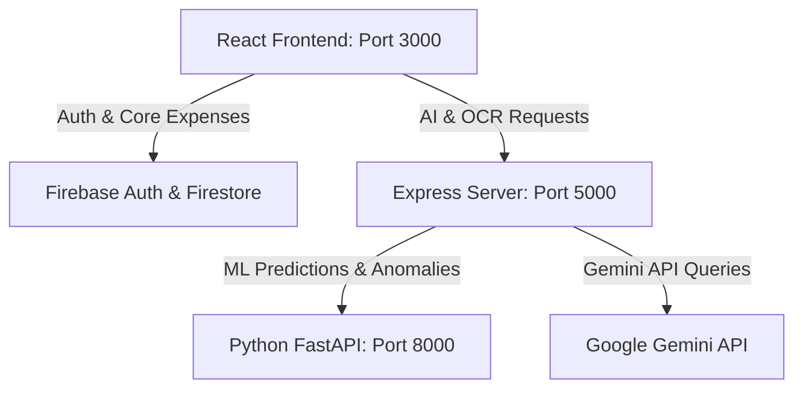

# Repository Knowledge Base (brain.md)

This file documents the key architecture, design decisions, and learned technical details of this repository.

---

## 🏗️ Architecture Overview

The application is structured as a decentralized stack utilizing Firebase for core database storage and two local microservices for processing AI, OCR, and Machine Learning.

1. **Frontend (React)**: Handles authentication directly with Firebase Auth and persists transactions in Firestore. Queries local servers for predictions, scanning, and chat helper services.
2. **Backend Gateway (Node.js + Express)**: Listens on port `5000`. Acts as a secure endpoint to verify OCR receipts and prompt Gemini securely without exposing private API keys.
3. **ML Microservice (FastAPI + Python)**: Listens on port `8000`. Fits scikit-learn regression models and flags transaction anomalies.

---

## 💡 Key Lessons & Decisions

### 1. Database Choice (Firebase over MySQL)
* **Decision**: We chose to continue using **Firebase Firestore** for core expense management and **Firebase Auth** for login/signup, rather than migrating to MySQL.
* **Rationale**: Keeps client-side state handling simple and maintains compatibility with existing hosting setups. Data is fetched by the React client and passed to the backend server as JSON when analysis or forecasts are requested.

### 2. Gemini API Model Compatibility
* **Learned constraint**: The model `gemini-2.5-flash` is no longer available to new users, and `gemini-3.5-flash` is subject to high-demand errors (503).
* **Working Model**: We verified that **`gemini-3.1-flash-lite`** executes successfully, is extremely fast, and operates safely within free rate limits. All controller requests use `gemini-3.1-flash-lite`.

### 3. OCR Implementation
* **Decision**: We use **`tesseract.js`** inside the Express backend for OCR.
* **Rationale**: It runs completely in JavaScript (using WebAssembly) on Node.js, eliminating the need to install native Tesseract binaries on Windows or host machines.

### 4. Fail-safe ML Fallbacks
* **Learned constraint**: If the Python service is offline, the React app's dashboard or expense creation could hang or fail.
* **Solution**: The Express server implements **local rule-based fallback algorithms**:
  - *Predictions*: If FastAPI is down, it calculates predictions based on the user's historical daily average.
  - *Anomalies*: Bypasses Isolation Forest and flags the transaction if the amount is greater than 3x the average of that category.

### 5. Frontend Chart Rendering
* **Decision**: Chart.js is integrated directly via HTML5 `<canvas>` elements and React `useRef` hooks rather than wrapper packages like `react-chartjs-2`.
* **Rationale**: Avoids React 19 dependency resolution errors.
